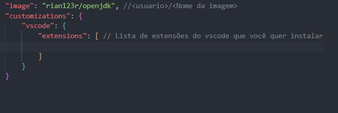

# Aula Docker - Dev Containers

###### Vamos abrir um container e vincular a um repositorio do git 

* Baixar a extensão do vscode Dev Containers
* No diretorio do container criar um arquivo chamado de .devcontainer.json
    Esse arquivo serve para extensão reconhecer    
    

* Fechar e abrir novamente o vscode
* Quando abrir essa mensagem no vscode, clique em reabrir no contêiner: 

obs: Você precisa reabrir somente a pasta java no vscode, pois a extensão procura na raiz do projeto o arquivo de configuração

* criar arquivo java com qualquer coisa, compilar e executar dentro do vscode

* A ideia é sempre que executar um arquivo ali ele executa dentro do container e quando estiver la no git a ideia é a mesma

* Terminal do vscode vai ficar assim quando estiver dentro do container: 

* No arquivo de configuração você consegue também instalar uma nova extensão somente para o container:

para adicionar copie o id da extensão aqui:

e cole na lista em formato de string assim:

* Reinicie o vscode dentro do container para aplicar kas extensões no container